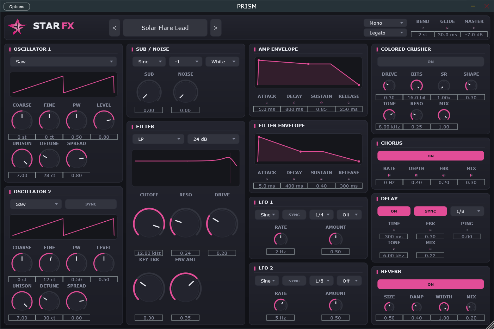

# PRISM

**A mono-focused lead & bass synthesizer.** UI branded **STAR FX**.
Plugin developer: **starfinesse** · Built by **34T** for starfinesse.



**▶ Windows — grab the ready plugin:** [Download the latest release](https://github.com/34tknowledge/PRISM/releases/latest) — unzip and drop `PRISM.vst3` into your VST3 folder, no build needed. macOS / from source: see [Building](#building) below.

A clean, minimal virtual-analogue synth built for fat monophonic leads and
basses — a dark, low-glare interface with a single pink accent, flat rotary
knobs, and live displays for the oscillator waveforms, filter response and
envelope shapes.

Formats: **VST3**, **Standalone** (and **AU** when built on macOS).

---

## Sound engine

- **Voice engine** — Poly / Mono / Legato with a Portamento (Glide) control and
  an *Always* vs *Legato-only* glide mode. Last-note priority in mono/legato.
- **2 oscillators** — Saw / Square / Triangle / Sine / PWM, anti-aliased
  (PolyBLEP). Per-osc coarse, fine, pulse-width, level, and **unison up to 7
  voices** with detune + stereo spread for huge stacked tones. Osc 2 can hard-sync
  to Osc 1.
- **Sub oscillator** (−1 / −2 oct, sine/square/triangle) + **noise** (white/pink).
- **Multi-mode filter** — LP / HP / BP / Notch at **12 or 24 dB/oct** (TPT state
  variable), with **drive**, **key tracking** and bipolar envelope amount.
- **2 ADSR envelopes** (amp + filter) with live curve displays.
- **2 LFOs** with tempo sync and a routing destination each (pitch, PWM, cutoff,
  resonance, amp tremolo, pan).

## Effects chain

Colored Crusher → Chorus → Delay → Reverb.

- **Colored Crusher** — a character effect, not a generic clipper: a lo-fi AD/DA
  path modelled after the Decimort/Krush lineage — bit-depth reduction with
  grid-bias + error-feedback noise-shaping, fractional sample-rate reduction
  (sample & hold), an asymmetric waveshaper for even-harmonic warmth (with DC
  blocker), and a **resonant tone filter** that tames the aliasing and voices the
  grit.
- **Chorus**, tempo-syncable **Delay** (feedback, ping-pong, tone damping) and a
  lush **Reverb**.

## Factory presets (60)

**60** hand-tuned presets across **Leads · Basses · Keys/Plucks · Pads**, grouped
into per-category submenus in the preset browser and also exposed as programs in
your DAW's own preset list. Every preset has real, distinct parameter values.

---

## Building

See **[BUILD.md](BUILD.md)** for full details.

**Easiest (Windows):** run the driver script, which sets up the MSVC environment
and builds Release automatically:

```powershell
powershell -ExecutionPolicy Bypass -File build.ps1
```

**Manual (from an *x64 Native Tools* prompt with CMake + Ninja on PATH):**

```bat
cmake -S . -B build -G Ninja -DCMAKE_BUILD_TYPE=Release
cmake --build build
```

JUCE 8 is fetched automatically by CMake — nothing to install by hand. On macOS
the build additionally produces the **AU**.

The artefacts land in `build/Prism_artefacts/Release/` (`VST3/PRISM.vst3` and
`Standalone/PRISM.exe`). Copy the `.vst3` into your plugin folder
(`C:\Program Files\Common Files\VST3` on Windows,
`~/Library/Audio/Plug-Ins/VST3` on macOS) and rescan.

## Notes

- Verified against **pluginval** at strictness 8 (clean).
- The repo contains only original code; JUCE is fetched at build time, so JUCE's
  own licence applies to the framework when you build/ship.
